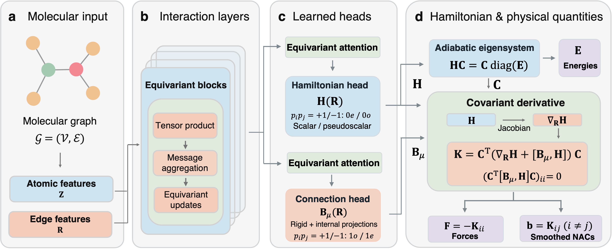

# Parity-Equivariant And Covariant Excited-states learning (PEACE) 

<p align="center">

</p>

## Framework


## Installation

```bash
git clone https://github.com/solvendus/peace.git
cd peace
python -m pip install .
```

## Example

```bash
cd examples
peace-predict --config ../configs/CH2S/model_config.yaml --params ../configs/CH2S/params.pickle
  --xyz geometry.xyz --output prediction.npz
```

## PEACE calculator

```python
from peace import Calculator

calc = Calculator("/path/to/model_config.yaml", "/path/to/params.pickle")
result = calc.predict(
    atomic_numbers=[6, 16, 1, 1],
    positions=[[0., 0., 0.], [1.62, 0., 0.],
               [-0.55, 0.92, 0.02], [-0.55, -0.92, -0.02]],
)
print(result["energies"])
print(result["forces"])
```

| Array | Unit | Shape |
| --- | --- | --- |
| `energies` | eV | (n_states,) |
| `forces` | eV / Angstrom | (n_states, n_atoms, 3) |
| `nacs` | 1 / Angstrom | (n_pairs, n_atoms, 3) |
| `snacs` | eV / Angstrom | (n_pairs, n_atoms, 3) |
| `nac_pairs` | zero-based state indices | (n_pairs, 2) |
| `hamiltonian` | eV | (n_electronic, n_electronic) |
| `soc` | eV | (n_electronic, n_electronic) |

## SHARC interface

Use `interfaces/SHARC_PEACE.py` in an existing [SHARC 4](https://github.com/sharc-md/sharc4) installation. It
supports real and SOC models. Set `SHARC` or `PYTHONPATH` so SHARC's own
`SHARC_FAST.py` is available. Install PEACE in that Python environment.

Put `PEACE.template` beside the interface input:

```text
modelpath /path/to/model_config.yaml
paramspath /path/to/params.pickle
```

SHARC's own Python dependencies, including [PySCF](https://github.com/pyscf/pyscf), belong to the external SHARC installation.